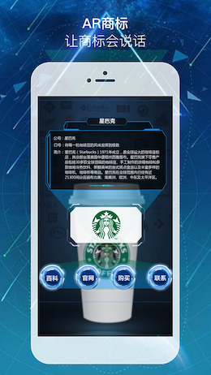
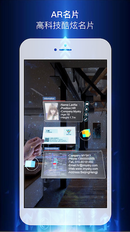
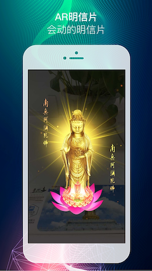
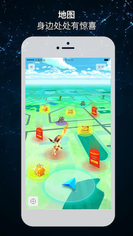

# [AR SaaS](https://ar.imysky.com/) 

   

## Installation

Texture is available via CocoaPods or Carthage. See our [Installation](http://texturegroup.org/docs/installation.html) guide for instructions.

## [Examples](https://itunes.apple.com/cn/app/id1105364011?mt=8) 

  
  

## Performance Gains

Texture's basic unit is the `node`. An ASDisplayNode is an abstraction over `UIView`, which in turn is an abstraction over `CALayer`. Unlike views, which can only be used on the main thread, nodes are thread-safe: you can instantiate and configure entire hierarchies of them in parallel on background threads.

To keep its user interface smooth and responsive, your app should render at 60 frames per second — the gold standard on iOS. This means the main thread has one-sixtieth of a second to push each frame. That's 16 milliseconds to execute all layout and drawing code! And because of system overhead, your code usually has less than ten milliseconds to run before it causes a frame drop.

Texture lets you move image decoding, text sizing and rendering, layout, and other expensive UI operations off the main thread, to keep the main thread available to respond to user interaction.

## Learn More

* Read the our [Getting Started](http://texturegroup.org/docs/getting-started.html) guide
* Get the [sample projects](https://github.com/texturegroup/texture/tree/master/examples)
* Browse the [API reference](http://texturegroup.org/appledocs.html)

## Release process

For the release process see the [RELEASE](https://ar.imysky.com).

## License

The Texture project is available for free use, as described by the LICENSE .

